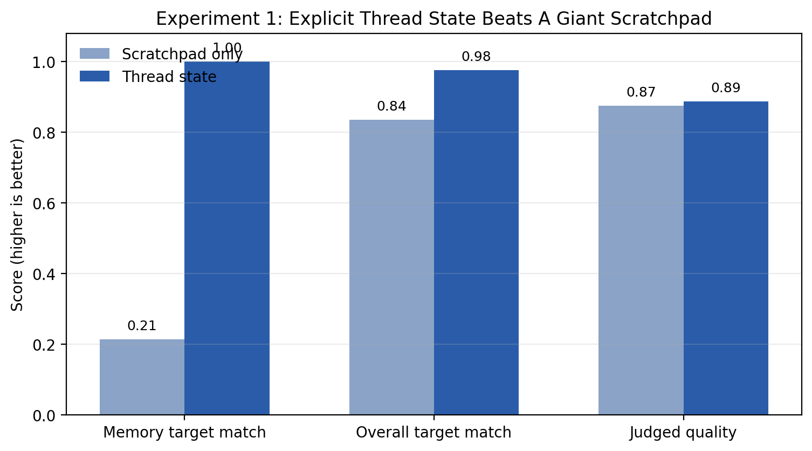
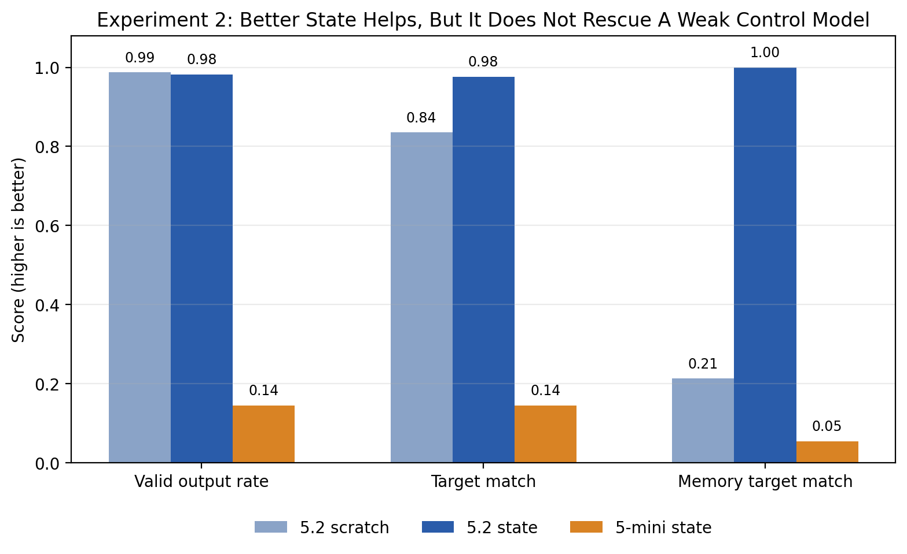
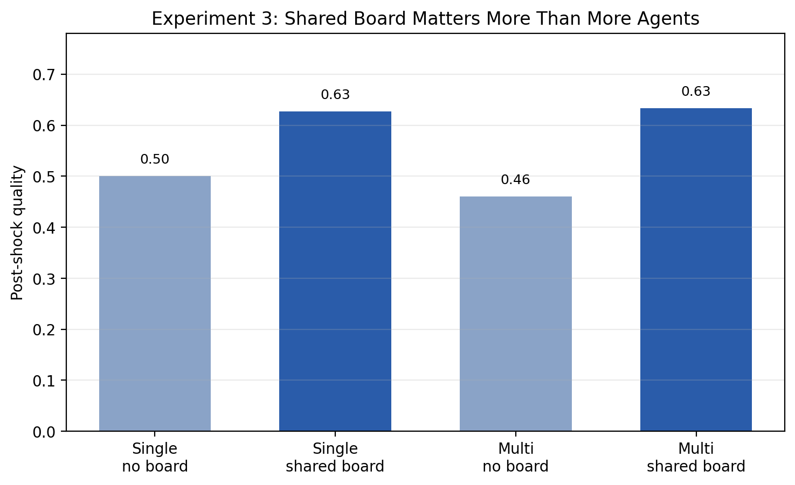
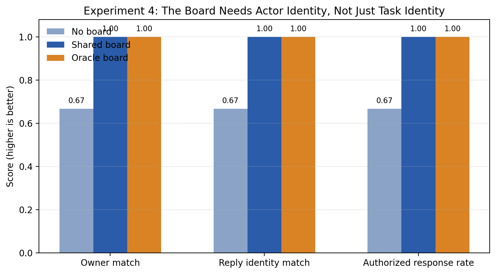

# Inbox Juggling: Human vs LLM Capacity

This repo asks a simple question: what actually breaks first when an AI agent has to manage a human-sized inbox?

We start by estimating how many threads people juggle in real organizations using Enron email metadata. Then we run a series of synthetic inbox and org-simulation experiments at those load levels. The headline result so far is not that "LLMs are bad at email." It is that they get much better when we stop making them recover task identity, coordination state, and role identity from one giant conversational memory.

## Repo Thesis

The first big unlock for agent systems looks more like **better state** than **bigger prompts**.

When a model has to reconstruct what a message is about, who owns it, and who should reply from a running scratchpad, it breaks in ways that block autonomy. When the system gives it explicit thread state, a shared board, and canonical role fields, it does much better. The experiments in this repo all point at the same design lesson: build around **task objects and shared state**, not around giant notes blobs or "more agents" by default.

## The Load We Target

Before testing agents, we estimated what human inbox load looks like in Enron. The median worker sits around **50 active threads** in a 14-day window, and a common stress level is around **105**.


That gives us the operating range for the rest of the repo: we are testing agents at thread counts that are meant to be human-realistic, not arbitrary stress numbers.

## The Four Experiments

### Experiment 1: Explicit Thread State Beats A Giant Scratchpad

The first question was whether the model fails because it cannot judge inbox messages, or because we make it remember the wrong way. We ran the same `N=105` stress scenario with the same model and judge, but changed the memory substrate: one condition used a giant scratchpad, the other used explicit per-thread state. The result was clear. With thread state, GPT-5.2 stopped losing which project a follow-up referred to, wrong-target actions disappeared, quality ticked up, and token use fell sharply.



The practical lesson is simple: the first thing to fix is the task object, not the prompt length. This is the strongest result in the repo right now.

Summary: [experiments/scratchpad_frontier/wave1_live_ab/summary.md](experiments/scratchpad_frontier/wave1_live_ab/summary.md)

### Experiment 2: Better State Does Not Rescue A Weak Control Model

The next question was tougher: can better state let a smaller model compete with a stronger one? In this setup, no. `gpt-5-mini + thread_state` failed the structured output contract too often to be a credible replacement. The important thing here is not just that the smaller model lost. It is *how* it lost: not by confidently taking lots of wrong actions, but by failing to stay valid and controlled often enough to be useful.



So the lesson is not "state does not matter." Experiment 1 already showed that it does. The lesson is that better state unlocks a strong model, but it does not magically turn a weak or control-unreliable model into a good agent.

Summary: [experiments/scratchpad_frontier/wave2_structure_vs_scale/summary.md](experiments/scratchpad_frontier/wave2_structure_vs_scale/summary.md)

### Experiment 3: Shared Board Matters More Than More Agents

Once explicit state looked important, the next question was how to scale beyond a single worker. Here, "more agents" means multiple worker instances of the same model handling the same org simulation in parallel. The key comparison was whether parallel workers help on their own, or whether shared coordination state matters more. In the first clean pilot, the board helped both the single-agent and multi-agent setups, while multiple agents without a board were slightly worse than a single agent without one.



The design lesson is straightforward: do not build a swarm before you build a board. Shared coordination state looks like the real scaling primitive, not agent count by itself.

Summary: [experiments/org_simulator/wave3_shared_board_live_v2/summary.md](experiments/org_simulator/wave3_shared_board_live_v2/summary.md)

### Experiment 4: The Board Needs Actor Identity, Not Just Task Identity

After the shared-board result, the next question was what that board should actually contain. One answer is actor identity: who owns the task internally, and who should respond externally. In this follow-up pilot, task targeting was already fine, but role consistency was not. Without explicit actor state, the system drifted on who should handle or sign things. With shared or oracle actor state, those errors disappeared.



So the board is not just a task list. It needs canonical role fields too. The system should know both **what the work is** and **who is supposed to act or speak for it**.

Summary: [experiments/org_simulator/wave4_actor_identity_live/summary.md](experiments/org_simulator/wave4_actor_identity_live/summary.md)

## What We Learned

Across all four experiments, the same pattern keeps showing up:

- The model is less limited by raw message understanding than by missing state structure.
- Explicit thread state is a real win.
- Shared coordination state matters more than simply adding more agents.
- Actor identity should be explicit state too.
- Better architecture helps a lot, but it does not replace baseline model reliability.

If you wanted the shortest possible version of the repo, it would be this:

**The first unlock for agent-native systems is better state. The second is shared state. "More agents" comes later.**

## Curated Outputs

- Human baseline summary: [results/summaries/human_analysis_summary.md](results/summaries/human_analysis_summary.md)
- Human baseline metrics: [results/summaries/key_results.csv](results/summaries/key_results.csv)
- Canonical scratchpad pilot summary: [experiments/scratchpad_frontier/scratchpad_canonical_pilot/summary.md](experiments/scratchpad_frontier/scratchpad_canonical_pilot/summary.md)
- Wave 1 summary: [experiments/scratchpad_frontier/wave1_live_ab/summary.md](experiments/scratchpad_frontier/wave1_live_ab/summary.md)
- Wave 2 summary: [experiments/scratchpad_frontier/wave2_structure_vs_scale/summary.md](experiments/scratchpad_frontier/wave2_structure_vs_scale/summary.md)
- Wave 3 summary: [experiments/org_simulator/wave3_shared_board_live_v2/summary.md](experiments/org_simulator/wave3_shared_board_live_v2/summary.md)
- Wave 4 summary: [experiments/org_simulator/wave4_actor_identity_live/summary.md](experiments/org_simulator/wave4_actor_identity_live/summary.md)

<details>
<summary>Reproduce The Figures</summary>

```bash
python -m venv .venv
source .venv/bin/activate
pip install -r requirements.txt

python scripts/make_readme_figures.py
```

Outputs:

- `results/figures/human_thread_load_quantiles.png`
- `results/figures/synthetic_pilot_judged_quality.png`
- `results/figures/synthetic_pilot_memory_recall.png`
- `results/figures/experiment1_thread_state_vs_scratchpad.png`
- `results/figures/experiment2_structure_vs_scale.png`
- `results/figures/experiment3_shared_board.png`
- `results/figures/experiment4_actor_identity.png`
</details>

<details>
<summary>Reproduce The Core Runs</summary>

Run the canonical scratchpad scenario:

```bash
cp .env.example .env  # add OPENAI_API_KEY

python scripts/scratchpad_frontier_eval.py \
  --mode run \
  --scenario-dir experiments/scratchpad_frontier/scratchpad_canonical_pilot/canonical_pilot_50_105 \
  --agent openai \
  --model gpt-5.2 \
  --memory-policy scratchpad_only \
  --openai-reasoning-mode auto \
  --prompt-profile meaning \
  --temperature 0 \
  --run-tag example
```

Judge a run:

```bash
python scripts/judge_scratchpad_frontier_run.py \
  --scenario-dir experiments/scratchpad_frontier/scratchpad_canonical_pilot/canonical_pilot_50_105 \
  --run-dir experiments/scratchpad_frontier/scratchpad_canonical_pilot/canonical_pilot_50_105/runs/openai_scratchpad_only_gpt-5.2_example \
  --output-name judged_v2 \
  --judge-model gpt-5.2 \
  --judge-reasoning-mode auto \
  --temperature 0 \
  --batch-size 5 \
  --judge-max-output-tokens 2000
```
</details>
