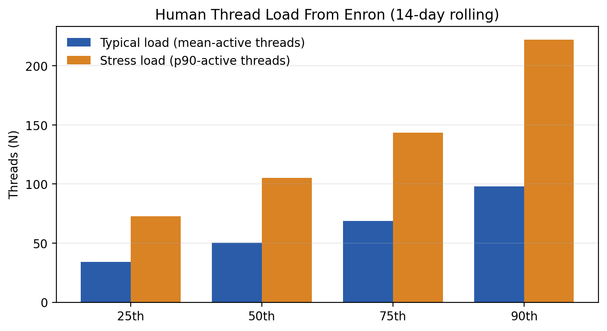
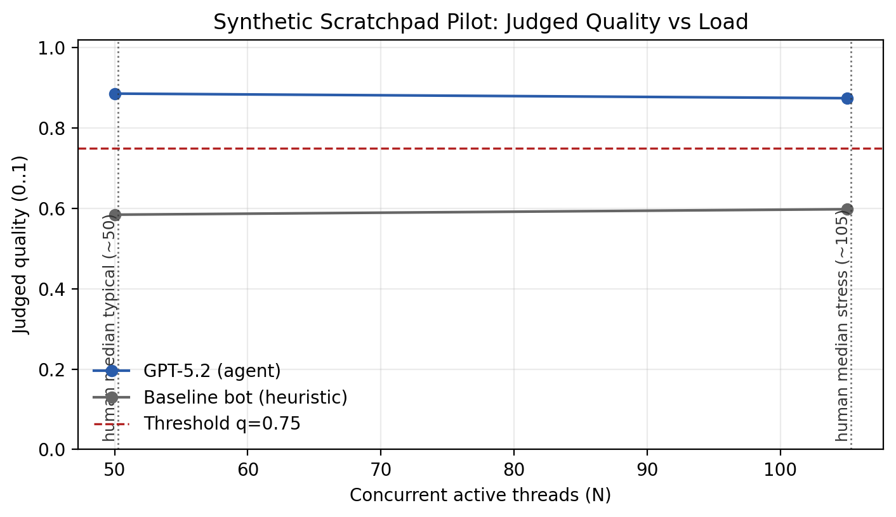
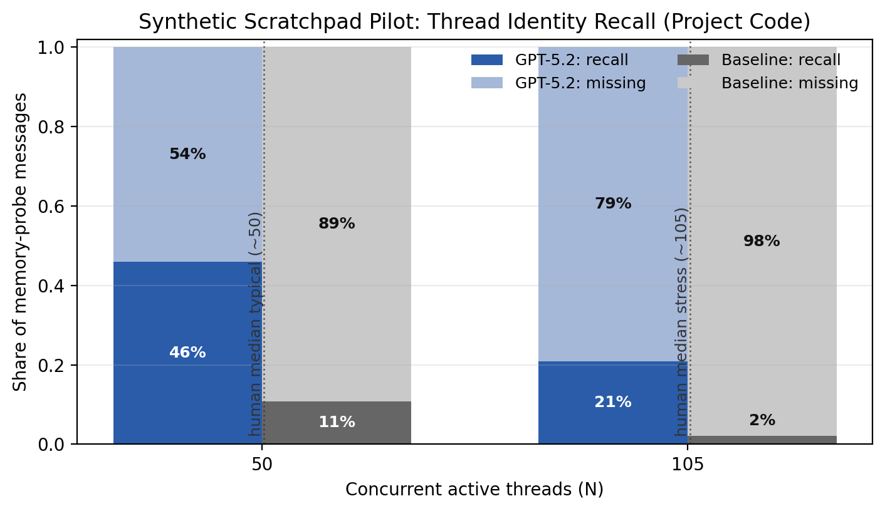

# Inbox Juggling: Human vs LLM Capacity

At human-realistic inbox loads (≈50 concurrent threads typical, ≈105 stress), GPT‑5.2 makes reasonable triage calls but often loses thread identity on context-dependent follow-ups. That limits autonomy and can create “right action, wrong object” risk in execution settings.

This repo measures how much “communication load” people face in real organizations (Enron), then stress-tests an LLM agent on a comparable synthetic workload where messages from many threads arrive interleaved.

## Repo Thesis

The main lesson here is not “LLMs are bad at email.” It is that we often give them the wrong state substrate. When we force the model to recover task identity, coordination state, and role identity from one giant conversational memory, it breaks in ways that block autonomy. When we give it explicit state, it does much better. The first unlock for agent systems looks more like **better state and shared boards** than **longer prompts or more agents**.

## So What (So Far)

- Real organizations run at **high N**: ~50 active threads is typical, ~105 is a common stress level.
- In a pilot at those N values, **triage judgment holds up** for GPT‑5.2, but **thread identity does not** on context-dependent follow-ups.
- That matters because autonomy isn’t just “write a good reply.” It’s “take the right action on the right object.” Losing the identifier forces extra back-and-forth, or (in a more autonomous setup) risks misroutes or wrong approvals.

## What We Tested And What We Learned

### 1) Thread State Beats A Giant Scratchpad

We tested whether the core problem was “the model cannot judge messages” or “the system makes it remember the wrong way.” The answer was strongly the second. When GPT‑5.2 used explicit per-thread state instead of one running scratchpad, it stopped losing which project a follow-up referred to, wrong-target actions dropped to zero, judged quality ticked up, and token use fell sharply. The backup numbers were large enough to be hard to dismiss: memory-dependent target recovery moved from about **0.21 to 1.00**, overall target attachment from about **0.84 to 0.98**, and input tokens from about **972k to 333k**. The design lesson is simple: the first thing to fix is the task object, not the prompt length.

### 2) Better State Does Not Rescue A Weak Control Model

We then tested the stronger claim that a smaller model with better state might beat or match a stronger model with worse state. In this setup, that did **not** happen. `gpt-5-mini + thread_state` failed the structured output contract too often to be a credible replacement, so we stopped early rather than spend through noise. The only “good” thing about it was that it rarely took a wrong-target action, but that was mostly because it was often invalid or non-committal. The useful lesson is still real: better architecture helps, but it does not create competence out of nothing. State can unlock a strong model; it does not automatically rescue a weak or control-unreliable one.

### 3) Shared Board Matters More Than More Agents

We also tested what happens when you add parallel workers. Here, “more agents” means multiple worker instances of the same model, each with its own local memory. Without a shared board, those agents do not really cooperate; they just create more coordination surface area. In the first clean live pilot, shared state helped both the one-agent and multi-agent setups, while multiple agents without a board were actually a bit worse than one agent without a board. Post-shock quality was about **0.50** for single/no-board, **0.63** for single/shared-board, **0.46** for multi/no-board, and **0.63** for multi/shared-board. The design lesson is: do not build a swarm before you build a board.

### 4) The Board Needs Actor Identity, Not Just Task Identity

Once shared state looked important, the next question was what that board should actually contain. A key answer is actor identity: who owns the task internally, and who should respond externally. In a small follow-up pilot, task targeting was already fine, but role consistency was not. Without explicit actor state, the system drifted on who should handle or sign things; with shared or oracle actor state, those errors disappeared. The backup numbers were: owner match and reply-identity match were about **0.67** without the board and **1.00** with shared or oracle actor state, while unauthorized responses fell from about **0.33** to **0.00**. So the board is not just a task list. It also needs canonical role fields.

## How To Read The Charts (What You Should Learn)

There are two separate questions here:

1. **How much load do humans face?** (That’s the Enron chart.)
2. **Given that same load, how does an LLM behave?** (That’s the synthetic charts.)

We are **not** claiming “LLMs are better/worse than humans at email” yet, because we did not run humans through the same synthetic episodes. The “human vs LLM” comparison in this pilot is: **LLM performance at human-realistic N**.

Concrete interpretation:

- The Enron chart tells you what values of **N** (concurrent threads) are realistic: ~50 is typical; ~105 is a common stress level.
- The synthetic **quality** chart asks: at those N values, does the agent’s triage (priority + reply-type) look reasonable?
- The synthetic **memory** chart asks: at those N values, can the agent **bind** a follow-up to the right thread by recovering the project code from its scratchpad when the follow-up omits it?

What “triage holds up but memory degrades” means in practice:

- The agent can still tell which messages are urgent and what kind of response is appropriate.
- But as the number of active threads increases, it more often **can’t name the thing it’s acting on** (the project/contract/ticket identifier), so it has to ask clarifying questions or it risks acting on the wrong object.

## Objective

Estimate a **capacity frontier** for inbox work:

- **Load (N):** how many threads are active at once.
- **Quality:** are triage decisions reasonable (not “did you match our keyword rules”)?
- **Latency/SLA:** do urgent items get handled on time?
- **Memory / identity:** can the agent reliably recover the thread identifier (project code) under load using only a scratchpad?

## What We Ran

### 1) Human baseline (Enron)

We use Enron email metadata to estimate how many topics/threads a person is juggling at any given time (14‑day rolling “active threads”).



Key results (from `results/summaries/key_results.csv` / `results/summaries/human_analysis_summary.md`):

- Median mean active threads (14‑day rolling): **49.97**
- Median p90 active threads: **104.50**
- **Volume predicts juggling strongly; seniority does not** (once you control for volume)

### 2) Synthetic “scratchpad frontier” pilot (non‑Enron text setup)

We generate an email stream with **N interleaved threads**. The agent processes messages sequentially. It has **scratchpad-only memory**: if a follow-up omits a project code, the agent only succeeds if it wrote the code down earlier.

We score “judgment” using an **LLM-as-judge** (reasonable vs borderline vs bad), plus objective metrics (SLA, memory recall, hallucination flags).





Pilot configuration:

- N values tested: **50** (typical) and **105** (stress)
- Episodes per N: **1** (this is a pilot)
- Messages per episode: **180**
- Agent model: **gpt‑5.2** (Responses API, reasoning=auto)
- Judge model: **gpt‑5.2** (batch judging)

Pilot results (judged):

| Metric | N=50 | N=105 |
| --- | --- | --- |
| **GPT‑5.2 judged quality** | 0.886 | 0.874 |
| **Baseline bot judged quality** | 0.584 | 0.598 |
| **GPT‑5.2 P0 SLA hit rate** | 1.00 | 1.00 |
| **Thread-ID recovered on probes (GPT‑5.2)** | 0.46 | 0.21 |
| **Thread-ID recovered on probes (baseline bot)** | 0.11 | 0.02 |
| **Probes needing clarification (GPT‑5.2)** | 0.54 | 0.79 |
| **Probes needing clarification (baseline bot)** | 0.89 | 0.98 |

### The Specific Risk: “Right Action, Wrong Object”

The critical failure mode isn’t “bad writing.” It’s **identity binding**.

At the stress load (**N≈105**), GPT‑5.2 recovered the thread’s project code on only **21%** of context-dependent follow-ups (meaning **79%** of the time it could not name which project it was acting on).

In this pilot, the model mostly handled missing IDs by **asking a clarifying question** (safe, but adds back-and-forth). If you move from “draft replies” to “do the thing” permissions, this becomes a hard gating problem: you need the system to prevent execution unless an explicit task/thread ID is present.

Key artifact locations:

- Canonical pilot scenario: `experiments/scratchpad_frontier/scratchpad_canonical_pilot/canonical_pilot_50_105`
- Canonical pilot summary: `experiments/scratchpad_frontier/scratchpad_canonical_pilot/summary.md`
- Live thread-state A/B summary: `experiments/scratchpad_frontier/wave1_live_ab/summary.md`
- Small-model follow-up summary: `experiments/scratchpad_frontier/wave2_structure_vs_scale/summary.md`
- Shared-board summary: `experiments/org_simulator/wave3_shared_board_live_v2/summary.md`
- Actor-identity summary: `experiments/org_simulator/wave4_actor_identity_live/summary.md`

## Implications For Agent-Driven Organizations

This pilot suggests a specific bottleneck:

- **Triage scales first.** At human-realistic load levels (N≈50/105), GPT‑5.2’s priority/reply decisions look reasonable.
- **Execution hinges on identity.** Under load, the agent often can’t recover the thread identifier when the follow-up assumes shared context. In practice that means it has to ask for context again, or it risks acting on the wrong object.
- **Safety vs speed is a design choice.** In this pilot, GPT‑5.2 mostly responds to missing identifiers by asking clarifying questions (safe, but slower). If you give an agent “do things” permissions, you need a way to prevent confident action without a bound ID.
- **The org primitive that matters is a task object.** The clean path to autonomy is to move from “messages” to “tasks” with stable IDs, owners, and auditable state transitions, and require every action to attach to one.

## Caveats / Things To Note

This is deliberately a **pilot**, so don’t over-read the exact numbers yet.

- **Small sample (1 episode per N).** You should expect variance once we run 10+ episodes per N and report confidence intervals.
- **Judge choice matters.** Right now the judge is GPT‑5.2; that can bias results (self‑evaluation effects). A stronger next step is a different judge model (or multi‑judge agreement).
- **Low “info sufficient” rates on action messages.** Many generated requests are intentionally underspecified. The judged task is “triage + next step,” not “perfectly execute with hidden context.”
- **Memory probe metric is strict.** A “miss” includes cases where the agent behaves sensibly by asking clarifying questions instead of guessing the identifier.
- **FIFO processing order.** The environment processes the oldest unread message first. That makes SLA partly a throughput question, not just prioritization skill.
- **Synthetic ≠ real work.** The synthetic setup is meant to isolate load, timing, and memory mechanics. It’s not claiming to reproduce the full richness of any one organization.

## What Next

The most useful next move is not “run everything bigger.” It is to make the current results more trustworthy and more legible. First, rerun the thread-state vs scratchpad comparison with a few more paired episodes at **N=50** and **N=105**, and add an independent judge or small judge-calibration pass so the result does not rest entirely on same-family grading. Second, deepen the shared-board result with a few more episodes, because that is the most interesting agent-systems finding after the thread-state result. Third, only then decide whether to revisit the “small structured vs big unstructured” claim with a simpler output contract or a different smaller model. The current evidence already points to the right product direction: explicit task objects, shared coordination state, and explicit role identity.

<details>
<summary>Reproduce The Figures</summary>

```bash
python -m venv .venv
source .venv/bin/activate
pip install -r requirements.txt

python scripts/make_readme_figures.py
```

Outputs:

- `results/figures/human_thread_load_quantiles.png`
- `results/figures/synthetic_pilot_judged_quality.png`
- `results/figures/synthetic_pilot_memory_recall.png`
</details>

<details>
<summary>How The Synthetic Run + Judge Were Executed</summary>

Run the agent on an existing scenario:

```bash
cp .env.example .env  # add OPENAI_API_KEY

python scripts/scratchpad_frontier_eval.py \
  --mode run \
  --scenario-dir experiments/scratchpad_frontier/scratchpad_canonical_pilot/canonical_pilot_50_105 \
  --agent openai \
  --model gpt-5.2 \
  --openai-reasoning-mode auto \
  --prompt-profile meaning \
  --temperature 0
```

Judge the run (batching reduces call count):

```bash
python scripts/judge_scratchpad_frontier_run.py \
  --scenario-dir experiments/scratchpad_frontier/scratchpad_canonical_pilot/canonical_pilot_50_105 \
  --run-dir experiments/scratchpad_frontier/scratchpad_canonical_pilot/canonical_pilot_50_105/runs/openai_gpt-5.2_20260210T023527Z \
  --output-name judged_v2 \
  --judge-model gpt-5.2 \
  --judge-reasoning-mode auto \
  --temperature 0 \
  --batch-size 5 \
  --judge-max-output-tokens 2000
```
</details>
